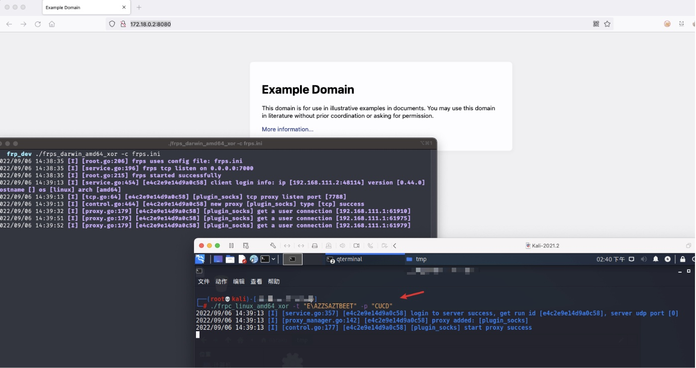
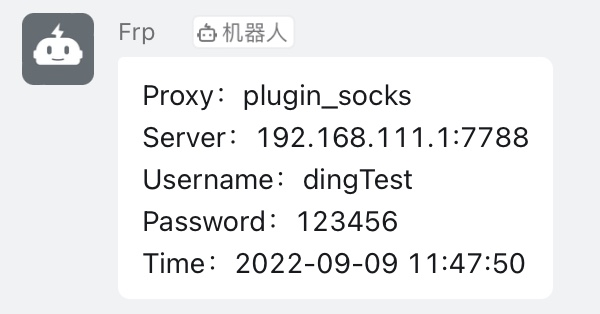

# frp-Modify

## 使用说明
- 在`cmd/frpc/sub/root.go#getFileContent()`函数中，按需修改 FRPC 配置和`key`（默认`testkey`）

```Go
func getFileContent(ip string, port string) {
	key := "testkey"
	ip = str2xor(ip, key)
	port = str2xor(port, key)

	var configContent string = `[common]
        server_addr = ` + ip + `
        server_port = ` + port + `
	tls_enable = true 
	[plugin_socks]
	type = tcp
	remote_port = 7788
	plugin = socks5
	#plugin_user = ""
	#plugin_passwd = ""
	`
	fileContent = configContent
}

```

- 确保安装 Go-1.16+ 和 GCC 环境，然后运行`package.sh`进行交叉编译

```bash
$ go env -w GOPROXY=https://goproxy.cn,direct  # 设置代理
$ ./package.sh

```

- FRPS正常运行，FRPC则需要传入异或后的字符串。可通过`xor.py`脚本进行异或，异或后的字符串可能存在特殊字符`\`，因此建议使用双引号包裹

```bash
$ ./frpc -t <IP> -p <端口>
$ ./frpc -t "E\AZZSAZTBEET" -p "CUCD"  # 192.168.111.1:7000

```




## 钉钉提醒
- 需要在`client/control.go#HandleNewProxyResp()`函数中配置钉钉机器人`AccessToken`和`Secret`，然后在前面的配置部分添加相关`plugin_user`和`plugin_passwd`即可

```GO
func (ctl *Control) HandleNewProxyResp(inMsg *msg.NewProxyResp) {
    // ...

	if err != nil {
		xl.Warn("[%s] start error: %v", inMsg.ProxyName, err)
	} else {
		// 配置钉钉机器人
		dingAccessToken := ""
		dingSecret := ""
        
        // ...
	}

    // ...
}

```




## 域前置
- 修改依赖包 `go/pkg/mod/golang.org/x/net@v0.0.0-202xxx/websocket/client.go#NewConfig()` 方法，添加回源 Host 

```diff
func NewConfig(server, origin string) (config *Config, err error) {
	config = new(Config)
	config.Version = ProtocolVersionHybi13
	config.Location, err = url.ParseRequestURI(server)
	if err != nil {
		return
	}
	config.Origin, err = url.ParseRequestURI(origin)
	if err != nil {
		return
	}
	config.Header = http.Header(make(map[string][]string))
+	config.Header.Set("Host", "test.baidu.local")
	return
}
```

- 然后修改 `go/pkg/mod/golang.org/x/net@v0.0.0-202xxx/websocket/hybi.go#hybiClientHandshake()` 方法

```diff
func hybiClientHandshake(config *Config, br *bufio.Reader, bw *bufio.Writer) (err error) {
	bw.WriteString("GET " + config.Location.RequestURI() + " HTTP/1.1\r\n")

	// According to RFC 6874, an HTTP client, proxy, or other
	// intermediary must remove any IPv6 zone identifier attached
	// to an outgoing URI.

+	// FRP Websocket Host
+	host := config.Location.Host
+	if tmpHost := config.Header.Get("Host"); tmpHost != "" {
+		host = tmpHost
+	}
+	bw.WriteString("Host: " + removeZone(host) + "\r\n")
+	// bw.WriteString("Host: " + removeZone(config.Location.Host) + "\r\n")
 
    // ...
}
```

- 最后在`cmd/frpc/sub/root.go#getFileContent()`中配置开启 Websocket 协议

```
protocol = websocket

```

## 参考文章
- [FRP改造计划](https://uknowsec.cn/posts/notes/FRP%E6%94%B9%E9%80%A0%E8%AE%A1%E5%88%92.html)
- [FRP改造计划续](https://uknowsec.cn/posts/notes/FRP%E6%94%B9%E9%80%A0%E8%AE%A1%E5%88%92%E7%BB%AD.html)
- [frp改版-域前置](https://xz.aliyun.com/t/11460)
- [https://github.com/wanghuiyt/ding](https://github.com/wanghuiyt/ding)
